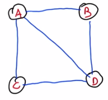

# Intro to Algorithms

**Udacity: CS 215**

---

### Eulerian Path

More on graphs! Let's talk about something called an *Eulerian Path*, named after [Leonhard Euler](http://en.wikipedia.org/wiki/Leonhard_Euler). Euler, if you don't know, was a Swiss mathematician that made many important contributions to different areas of math and science; one of which is graph theory.

Anyway, graph has an Eulerian Path if you can start at a node and hit every edge *exactly once*. The graphs of actors we looked at before were examples of graphs with this property. To examine this further, let's look at a simple graph:

This graph has an Eulerian Path starting at node "A":

    A --> B --> D --> A --> C --> D

Again, it's okay to hit the same node more than once; the only rule is that we can't travel over the same edge twice!

Let's look at the degrees of each node:

* A: 3
* B: 2
* C: 2
* D: 3

There's something interesting hidden here... notice how nodes B and C have an *even* degree, and we didn't start or end with either of them? This isn't a coincidence; in a Eulerian path, the nodes that we pass through (but don't start or end with) have to have an even degree! This is because we need to go in via one edge, and out via another. Try starting at B or C and you'll see what I mean. Likewise, that means that the start and end nodes have to have an odd degree!

To confirm this statement, let's try to find a Eulerian path for a graph where all of the nodes have even degrees:

