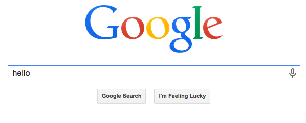

# Web Development

**Udacity: CS 253**

---

### URLs: Uniform Resource Locators

You've definitely seen URLs before! Here are a few examples:

* `http://google.com/calendar`
* `https://www.facebook.com`
* `https://www.youtube.com/watch?v=huYQL9v_guQ`

A URL is made up of three parts: The *protocol*, *host*, and *path*. Let's use `http://google.com/calendar` as an example.

1. Protocol: In this case, it's `http`. The protocol is simply a standard, or set of rules, governing how data is transferred over a network. HTTP and HTTPS are the most common, but others include FTP for downloading files and SMTP for email.
2. Host: In this case, it's `google.com`. The hostname is simply the location of the server where the files you're trying to access are stored. As we said before, those files can be anything; HTML documents, PDFs, images, etc.
    * Note: The hostmame is actually just an alias for an *IP address*, which is just a set of numbers separated by periods that identifies a computer connected to the Internet. For example. `facebook.com` just points to the IP address `173.252.110.27` (although, many IP addresses belong to Facebook so your mileage may vary).
3. Path: The location of the document we want to fetch. Just like your own computer has directories and file locations, the servers we're trying to connect to do as well.

**Query Strings**

We're going to add something new to our URL, called a *query parameter*. Query parameters are in the form "name = value", and the value can be just about anything. Here's an example:

    http://google.com?q=hello

If you were to type that URL into your browser, you'd end up on a page like this:

In the above URL, we added one query parameter: `q = hello`. We can have more than one though, separated by ampersands:

    https://google.com?q=hello&p=dog&x=3

Query parameters are separate from the path, but still part of the URL when used. We will learn more about these later, and put them to use too!

**Fragments**

A fragment is generally used to reference a specific piece of the HTML page you're looking at. Fragments are denoted by the `#` character, and are again part of the URL but *not* sent to the server when you make a request; they only exist in the browser.

    http://example.com/about#my_fragment

In the above case, we referenced a fragment of the page called `my_fragment`. Note that fragments should always come *after* the query parameters in a URL.

**Ports**

The last piece of URLs that we'll talk about are ports. When used in a URL, a port looks like this:

    http://udacity.com:8080

In the above case, we're connecting to port 8080 on udacity.com. The default port is 80. Get used to seeing port numbers if you're going to stick with web development! More on these later.

That's pretty much it on URLs for now. For the sake of tying everything together, here's a URL that uses everything we've talked about in this lesson:

    https://example.com:5000/about?q=foo#bar

The next set of notes will focus on HTTP requests and responses. See you then!

