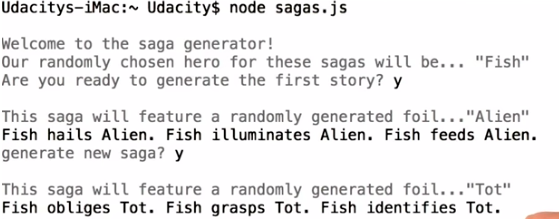

# Object-Oriented JavaScript

**Udacity: UD 015**

---

### Lesson 1: Scopes and Closures

**Scope**

We will learn about scope in the context of creating a game; this program will generate a "saga" for a fictional hero by:

1. Randomly picking a hero name
2. Randomly picking a foil character
3. Creating a random storyline for the two characters

Let's start by talking about lexical scope. In JavaScript, we start with the *global* scope. If I have 3 empty JavaScript files, and in one of them I declare a variable:

    var hero = aHero(); //pretend this function exists and returns a string for the hero's name

That variable is in the global scope. Anything in your project, even other files, can access that variable. Pretty simple, right? In simple JavaScript files that contain no functions at all, the global scope is the *only* scope.

Now, if I were to declare a function:

    var newSaga = function() {
        //stuff
    };

A new lexical scope has been created. There are new rules for variable access in the file now:

    //global scope
    var hero = aHero();
    
    var newSaga = function() {
        //new scope
    };
    
    //global scope
    
Creating a function (and it's new lexical scope) brings in some new rules:

1. From inside the funciton, you can still access and manipulate variables in the global scope.
2. However, you cannot do the reverse. See this example:

        var hero = aHero();
        var newSaga = function() {
            var foil = aFoil();
            
            console.log(hero); //this works
            console.log(foil); //this works too
        };
        
        console.log(hero); //this works
        console.log(foil); //oops! we can't see "foil" outside of the function it was defined in

**Things to consider**

To make matters a bit more confusing, if you leave out the `var` keyword when declaring a variable inside of a function, JavaScript will automatically assign that variable to the global scope. Take a look:

    var hero = aHero();
    
    var newSaga = function() {
        foil = aFoil(); //didn't use "var"
    };
    
    console.log(foil); //this works now
    
Don't leave the `var` keyword off! It'll only serve to make your code a bit more confusing. Another thing to look out for is conditional statements and loops; variables declared within an `if` statement, for example, do not create a new scope. See for yourself:

    var a = 1;
    
    if (a === 1) {
        var b = 2;
    }
    
    console.log(b);
    
Only functions create new scopes. The takeaway from this lesson is to always use the `var` keyword to make sure your intentions are clear! Scoping limitations are very helpful for keeping your code organized.