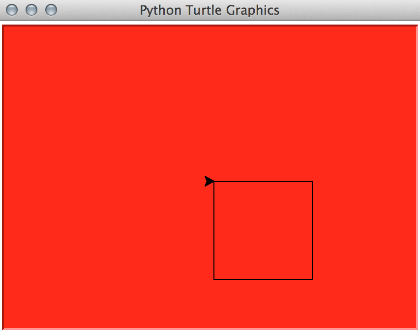

#Programming Foundations with Python

**Udacity: UD036**

---

###Lesson 2: Using Classes

This lesson will cover how to use these newfangled things called classes. At this point in time, we're pretty good at:

* Writing procedures
* Using loops, conditionals, variables, etc.
* Reading and understanding documentation
* Using imported modules

What we know so far is theoretically enough to do anything, but as we saw at the end of Lesson 1, it can get ugly when things get repetitive. That's where the power of classes come in. To become familiar with them, let's start by using Python's graphics.

###Turtle Graphics

Python has a graphics module called "turtle", which is perfect for learning about classes. Let's start by using it to draw a square:

	import turtle
	
	def draw_square():
		window = turtle.Screen()
		window.bgcolor('red')
		joe = turtle.Turtle()
		
		for i in range(0,4):
			joe.forward(100)
			joe.right(90)
		
		window.exitonclick()
	
	draw_square()
	
Save that code in a file and run it, and you should see something resembling this:

We can also change the shape, color, and speed of our turtle! Let's do that before I explain how all of this works:

	import turtle
	
	def draw_square():
		window = turtle.Screen()
		window.bgcolor('red')
		
		joe = turtle.Turtle()
		joe.shape('turtle')
		joe.color('green')
		joe.speed(3) # on a scale of 1 to 10, where 10 is fastest
		
		for i in range(0,4):
			joe.forward(100)
			joe.right(90)
		
		window.exitonclick()
	
	draw_square()
	
Running the code now will give us the same outpu, but things will look a bit different and move a bit slower.

###Classes

A lot of this code may seem a bit foreign at this point. How does Python know what a `Turtle()` is?

Inside the Python library, there is a file called `turtle`, just like we saw before with `time` and `os`. What's new is this thing called `Turtle` that we called. That's called a *class*. It's a bit different than the functions like `webbrowser.open` and `os.chdir` that we looked at before.

A class, for our purposes right now, is a neatly packaged box that puts a bunch of things together very well.

When we call `turtle.Turtle()`, we are creating what is called a new *instance* of that class, and technically calling a function called `__init__`, defined inside of the class `Turtle`. This picture should neatly describe how classes look compared to other modules lile `os` that we've dealt with so far:

Back to our code. We called our instance `joe`, and Joe can now access all of the methods defined inside the Turtle class! These include `color`, `forward`, etc. Read more about Turtle [here](https://docs.python.org/2/library/turtle.html), to see what it offers and the origin of the name.

A piece of the documentation that I'd like to highlight is the `turtle.Turtle()` class, which is inside the module `turtle` as stated before:

	class turtle.Turtle
		Subclass of RawTurtle, has the same interface but draws on a 		default Screen object created automatically when needed for the 		first time.
		
In summation, `Turtle` is one of the *classes* defined inside of the `turtle` module, and inside `Turtle` are some methods like `forward` that we can use when we create a new instance of `Turtle`.

###Another Way to Explain Classes

If that seems like a lot, let's invent a pretend class that might be more relatable than turtles. Let's say we have a class called `Person`, inside of the module `person` (the module name doesn't have to match the class name, but they just happen to in this case).

Let's start by using this pretend class:

	import person
	
	robert = person.Person()
	
All that we've done so far is import `person` and instantiate a new `Person` (which calls the `__init__` method; more on this later). Let's expand on this by using a pretend method inside of `person.Person` called `set_name`:

	robert.set_name('Robert Johnson')
	
This imaginary method set the `name` variable (which is hidden inside of the class) to `Robert Johnson`. If we want to see that variable's value, we can call another pretend method called `name`:

	print robert.name()
	
	>>> Robert Johnson
	
Although there is a lot more to classes than what we've covered so far, this should be a simple enough introduction to make everything seem sensible. Basically, classes are a nice way of packaging reusable code to create structures and operate on them. In the case of `Person`, we can easily create as many people as we want:

	robert = person.Person()
	joanna = person.Person()
	ty = person.Person()
	# etc...
	
Why we want classes will continue to make more sense as we go on, so let's continue!

###Two Turtles

We can give a nice summary of what we've learned through code:

	import turtle
	
	def draw_stuff():
		window = turtle.Screen()
		window.bgcolor('red')
		
		brad = turtle.Turtle()
		brad.shape('turtle')
		brad.color('yellow')
		brad.speed('2')
		
		for i in range(0,4):
			brad.forward(100)
			brad.right(90)
		
		dianna = turtle.Turtle()
		dianna.speed(8)
		dianna.color('green')
		
		for i in range(0,3):
			dianna.forward(100)
			dianna.left(120)
			
		window.exitonclick()
		
	draw_stuff()
	
###Improving Code Quality

Maybe we want to be able to abstract away our `draw_square` code into it's own procedure. We can easily do this, since we can pass in a `Turtle` just like we could a list, string, or integer like before:

	import turtle
	
	def draw_square(my_turtle):
		for i in range(0,4):
			my_turtle.forward(100)
			my_turtle.right(90)
			
We could then do something like this:

	sam = turtle.Turtle
	
	draw_square(sam)
	
This is pretty nice!

###More on Classes

We can think of a class as a blueprint for something. That blueprint contains information about the class, and can be used to create unlimited instances.

With `turtle`, we created two instances of `Turtle` called `joe` and `dianna`.

###Recursion Fun

Since we already know about recursion (if you took CS 101), and we can now draw things, let's learn about something called a "fractal".

A fractal is an object that displays self-similarity, no matter the size or scale. We can think of a fractal as a recursive structure; a large fractal can be broken up into a bunch of smaller versions of the same thing. Here are some examples, read them left to right to see how fractals work:

Since fractals have recursive definitions, we can explain them using code. Let's draw some with Turtle Graphics! This example is pretty complex, but simpler ones can be found [here]().

	import turtle

	def drawTriangle(points,color,myTurtle):
		myTurtle.fillcolor(color)
		myTurtle.up()
		myTurtle.goto(points[0][0],points[0][1])
		myTurtle.down()
		myTurtle.begin_fill()
    		myTurtle.goto(points[1][0],points[1][1])
    		myTurtle.goto(points[2][0],points[2][1])
    		myTurtle.goto(points[0][0],points[0][1])
    		myTurtle.end_fill()

	def getMid(p1,p2):
    		return ( (p1[0]+p2[0]) / 2, (p1[1] + p2[1]) / 2)

	def sierpinski(points,degree,myTurtle):
    		colormap = ['blue','red','green','white','yellow',
                'violet','orange']
    
    		drawTriangle(points,colormap[degree],myTurtle)
    		if degree > 0:
        		sierpinski([points[0],
                         getMid(points[0], points[1]),
                         getMid(points[0], points[2])],
                   degree-1, myTurtle)
        		sierpinski([points[1],
                        getMid(points[0], points[1]),
                        getMid(points[1], points[2])],
                   degree-1, myTurtle)
        		sierpinski([points[2],
                        getMid(points[2], points[1]),
                        getMid(points[0], points[2])],
                   degree-1, myTurtle)

	def main():
		myTurtle = turtle.Turtle()
		myWin = turtle.Screen()
		myPoints = [[-100,-50],[0,100],[100,-50]]
		sierpinski(myPoints,4,myTurtle)
		myWin.exitonclick()
		
	main()

Run the code to see Sierpinksi triangles in action (or the Triforce as Zelda fans may call it)! This was unrelated to classes, but it's cool nonetheless.