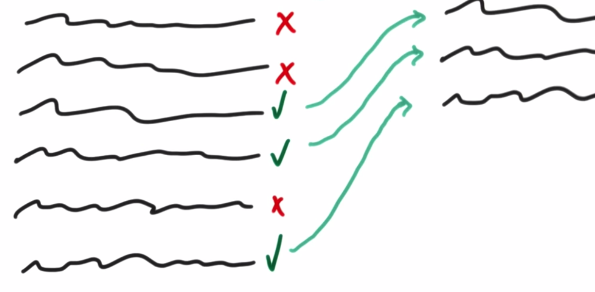

#Intro to Hadoop and MapReduce

**Udacity: UD 617**

---

###Filtering Patterns

Filtering is used to grab a small sub-set of our data; the original data set is never actually changed. We would just go through a large data set, decide which data to keep, and spit that desired data out to generate a smaller set to work with.

There are several types of filtering patterns:

1. Simple Filter
    * Function that returns something like "keep" or "throw away" for each line in the data set.
2. Bloom Filter
    * Space efficient and probabilistic data structure that checks if an element is in a given set.
    * Read more about the Bloom Filter [here](http://en.wikipedia.org/wiki/Bloom_filter).
3. Sampling
    * Generate a smaller data set from a large one by pulling out a sample (ex/ highest value in a field)
    
**Filtering practice**

Let's get some data to work with from the Udacity Forums. Forum posts can be long or short. We want to filter out all of the long posts, so we are left with just posts that are *one sentence or less*. See `code/lesson4/one_sentence.py` for the answer.

Another thing we can do with filtering patters is making "Top-N" lists. This would be especially useful if you worked at a company like BuzzFeed. With a traditional relational database, we would just sort the data by a certain key and then return the top 10 or so. This doesn't work with MapReduce and Hadoop, since the data is generally in many different formats and stored on several machines.

So, what we will do is have each Mapper generate their own top N, and then send that to the Reducers to find the global top N (think Olympics: each country sends their top athletes, and the competition decides who the world's best are). See `code/lesson4/top_n.py` for the solution.

