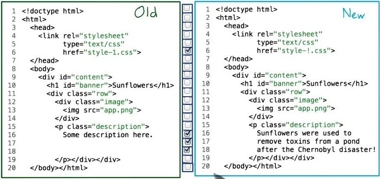

# Version Control

**Udacity: UD 775**

---

### Intro to the course

* Instructors: Caroline Buckey and Sarah Spikes of Udacity
* Topics covered:
    * History of Git
    * Why we need version control
    * Viewing commit history
    * Creating and modifying repositories
    * Branching, merging, committing
    * Using GitHub to collaborate with others
* Notable assignments:
    * Collaborate with other Udacity students on a project
    
### Lesson 1: Navigating a commit history

Effective use of version control is an important and useful skill for any developer working on long-lived (or even medium-lived) projects, especially if more than one developer is involved. This course, built with input from GitHub, will introduce the basics of using version control by focusing on a particular version control system called Git and a collaboration platform called GitHub.

Version control allows you to save and restore versions of your files from different points of time. This let's you write some code, save its state, continue editing, and then go back to the old state if you wanted! Every developer and company uses version control.

### Getting set up

What you'll need:

* Experience reading and writing code
* A [UNIX-style command line](https://www.udacity.com/wiki/command-line-instructions)

Let's go!

### Comparing files

To illustrate the utility of a version control system, let's take a look at two versions of the same file:

I've checked off the lines that changed in the file. Let's say that one of the changes was a mistake! While it's pretty simple to look at one small file and see what changed, imagine trying to compare two versions of a very large project manually! That can be a nearly impossible task in some cases.

Luckily for us, most operating systems have tools that can help us find differences between two files:

* Windows: FC
* Mac & Linux: diff

To try these programs out, do this:

1. Create two files, one called `a.txt` and the other called `b.txt`.
2. In `a.txt`, write this:

        up
        up
        down
        down
        left
        right
        left
        right
        b
        a

3. In `b.txt`, do this:

        up
        up
        down
        up
        left
        right
        left
        left
        b
        a

4. Then, open up your command line and type this:

        //if on mac or linux
        $ diff -u a.txt b.txt
        
        //if on windows
        > FC a.txt b.txt
        
You should see an output that looks something like this:

Notice how the computer displayed the sections that have differences? That's a lot better than doing it manually, especially for large files.

Hopefully, you're starting to see why version control is going to help us with programming projects!