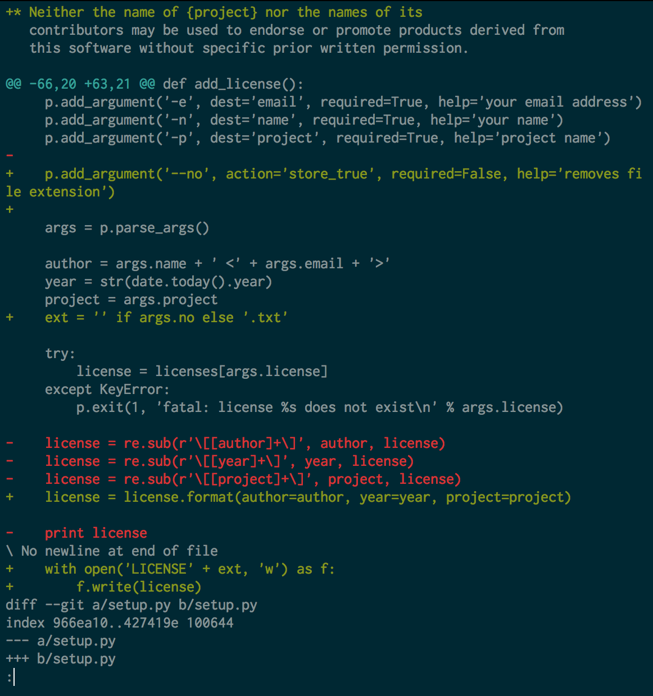
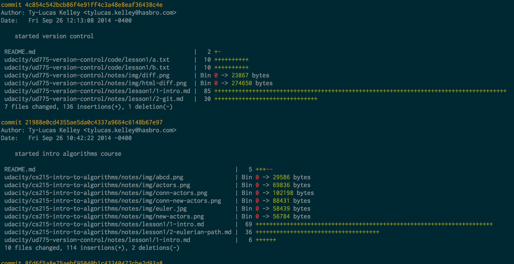

# Version Control

**Udacity: UD 775**

---

### Getting started with Git

The first thing we're going to do is install Git. You can get it [here](http://git-scm.com/), and if you're on a Mac or Linux computer, you can simply use a package manager like `brew` or `yum` to get it.

You can make sure you have git installed by going to a command line and typing `git`. You should get something like this:

**Commit logs**

What is a "commit"? It's just a snapshot of your project at a given time. In other words, making a "commit" to Git is just a fancy way of saying you're saving a version. Git commits are composed of a few parts:

1. The hash (a.k.a. the commit's ID): this is a unique identifier for each commit, and is used to distinguish between two commits. The algorithm used to generate the hash is SHA-1.
2. The date: the date and time that the commit was made.
3. The author: The name and email address of the person who made the commit (gotta be accountable!)
3. The message: Every commit comes with a user-defined message to describe what was changed since the previous commit.

Git has a `log` command that lets us see all the commit history:

The messages in the log help people understand why a particular commit was made. Additionally, it is important that every commit has an author: otherwise, how will we know who to hold accountable for good/bad code in a large project?

**Diff**

Git has its own `diff` command, just like Mac, Linux, or Windows. This one's a lot nicer though! It lets us see the differences between two commits.

Here's what that looks like:

As you can see, the color coding and line numbering helps a lot! Green is for added, black is for stayed the same, and red is for deleted.

### How often should I commit?

This is a good question, and depends on the project (and the person).

A good rule of thumb is to keep commits small. As the diff between two versions gets bigger, it gets harder to understand and less useful. However, you don’t want to make your commits too small either. If you always save a commit every time you change a line of code, your history will be harder to read since it will have a huge number of commits over a short time period.

A good rule of thumb is to make one commit per logical change. For example, if you fixed a typo, then fixed a bug in a separate part of the file, you should use one commit for each change since they are logically separate. If you do this, each commit will have one purpose that can be easily understood. Git allows you to write a short message explaining what was changed in each commit, and that message will be more useful if each commit has a single logical change. Here are some examples of good and bad commits:

* Good
    * You add a small new feature in one hour and commit the changes
* Too small
    * You fix two typos in the README file
* Too large
    * You fix two unrelated bugs but commit them at the same time
    * You work on a feature for a week and only commit when finished
    
### What if I have multiple files?

Pretty much every programming project will have more than one file involved. Luckily, git is based on *projects*, not single files. That means that a commit can involve more than one file at a time. The Git term for a project is a "repository".

A commit is simply a snapshot of every single file in your repository at the time you make the commit. You can change every file, just one, or ten in a commit. Let's use `git log --stat` to see what files were edited in each commit:

Now that you've been exposed to Git, let's start using it!