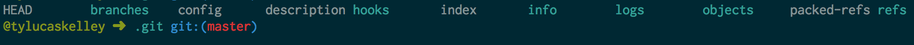

# Version Control

**Udacity: UD 775**

---

### Repositories

What makes a repository different from any other old project folder? The answer is hidden, but right in front of you!

There is a folder in the main project folder called `.git`, which contains metadata about your project, configuration settings, and other information that lets Git work the way it does. We won't go into too much detail about how Git works, but you can poke around in that folder like this:

    $ cd asteroids
    $ cd .git
    $ ls
    
`ls` should give you this output:

These directories and files are hidden because they don't need to be (and shouldn't be) modified by the user. All of these files and folders got here because we cloned an exisiting repository, but what about creating our own? Let's do that:

### Initializing a repo

Create an empty folder called `test` somewhere on your computer. Then, `cd` into that folder. We're going to turn this plain old directory into a Git repo using the `init` command:

    $ git init
    
That's all there is to it! To make sure it worked, do this:

    $ ls -a
    
And you should see the hidden `.git` folder. Since we haven't done anything yet, there are no commits. If you were to type `git log` right now, you'd get an error message called `fatal: bad default revision 'HEAD'`.

You can also use `git status` to see information about the current state of the repo:

Let's add a file called `foo.txt` to our test repo. Once you do that, type `git status` again:

Now we have a file called `foo.txt` that isn't tracked by Git. This means that Git knows it's there but these changes aren't ready to be committed. Let's talk about committing in the next set of notes!