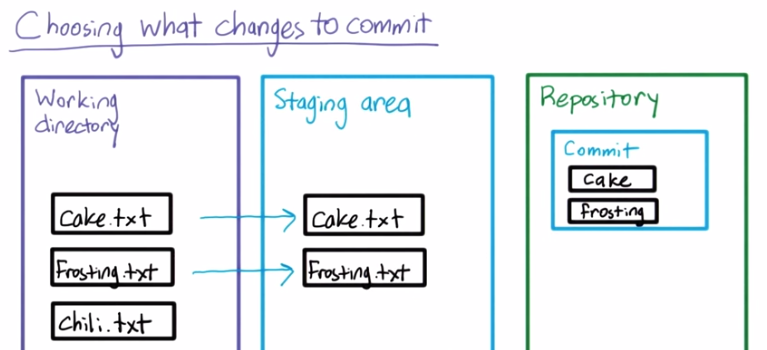

# Version Control

**Udacity: UD 775**

---

### Committing changes

**Staging**

Before we commit our new `foo.txt` file, we need to tell Git to track it. Using `git add [files...]` gives us more control over what is going to be committed, so we don't have to commit everything at once. Let's do it:

    $ git add foo.txt
    
Alternatively, you can add all files like this:

    $ git add -A
    
This intermediate stage between putting changes into our repository is called the "staging area". This picture illustrates how things look:

To remember what you've added for committing, just use `git status` again:

**Committing**

It's time to commit `foo.txt` to our repository! We use the `git commit` command to do this. We also need to supply a message with the commit.

    $ git commit -m "add empty foo.txt file"

Running `git status` now will give us this:

    On branch master
    nothing to commit, working directory clean
    
### Fixing a bug

Let's go back to the Asteroids repo. Right now there's a problem with the game; you can shoot without any delay, making the game far too easy! Let's fix that bug:

Open up `game.js` and add this on line 424 (right under the if statement):
        
    this.delayBeforeBullet = 10;

Now you're ready to commit those changes! First, open up `index.html` to make sure the game is working correctly, and then run `git status` to see this:

    On branch master
    Your branch is up-to-date with 'origin/master'.

    Changes not staged for commit:
    (use "git add <file>..." to update what will be committed)
    (use "git checkout -- <file>..." to discard changes in working directory)

        modified:   game.js

    no changes added to commit (use "git add" and/or "git commit -a")
    
We can see that the file we modified needs to be added and committed, so let's get to it:

    $ git add game.js
    $ git commit -m "fix bug where bullets shoot with no delay"
    
Boom! The game is fixed now.

### Revisiting git diff

Git's `diff` command can do a lot more than just compare two commits. Let's see some of those uses:

* `git diff`: compares the working directory and the staging area
* `git diff --staged`: compares the staging area and most recent commit
* `git diff commit1 commit2`: compares commit1 and commit2