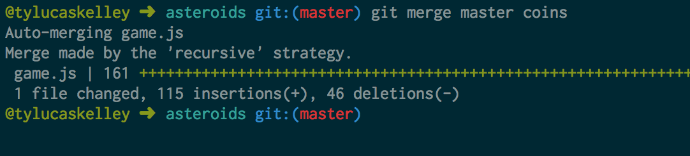

# Version Control

**Udacity: UD 775**

---

### Merging

Being able to create branches to work on features is useless unless we can put those shiny new changes on the master branch when we're ready. Git lets us do this using the `merge` command!

Let's pretend that we have two people, Jake and Rachel, working on `game.js` at the same time, but on their own branches. At the start of the day, the two versions of `game.js` are the same, but they make changes as time goes on, and are adding, editing, and removing lines. 

This picture attempts to demonstrate the changes that Jake and Rachel have been making. The lines that are the same in both version s are going to be kept in the merged one, but what about the lines that Jake has and Rachel doesn't, and vice versa? How does Git know what to keep and what to throw away?

Well, it depends. Let's say that at the start of the day, lines A, B, and D existed in the file. That means that at some point, Jake removed A, added E, and Rachel added C. So in our final version, we will keep lines B, C, D, and E.

This is a very simplified case, but before we get into any more detailed or problematic cases, let's merge the "coins" branch with master. This processes is called merging a branch "into" master, because the HEAD of master will change, and all of the commits that were part of the branch as well as master will become part of master now. We can then delete the reference to the old branch (which won't delete the commits though). The commits that are merged into master will be sorted by time.

Git knows what the code looked like before coins was branched off from master, so things should work out fine in theory. First, go back to the master branch:

    $ git checkout master
    
Then, run this:

    $ git merge master coins -m "merge coins into master"
    
Everything should have worked out, and you'll get a message like this:

We have now created the merge commit and the HEAD of master is now at that commit. Test things out by opening `index.html`! Run `git log` to see the details. Don't forget to delete the old coins branch using `git branch -d coins`.

### Merge conflicts

Now that we've had a good experience with merging, let's consider the case where Git isn't sure what to do to merge two files. Unfortunately, this can happen, especially on large projcets with lots of collaborators. When Git doesn't know what to do, we get a "merge conflict".

In the picture above, we can see that line B got messed with by both Jake and Rachel, so we aren't sure which version of B to put in the final file. Git calls this a merge conflict, and will keep both changes in the file. You'll have to manually go in and remove the conflict yourself, commit your changes, and merge again.

**Resolving merge conflicts**

So, what does a merge conflict look like? Let's see. Run this code:

    $ git checkout easy-mode

And then try to merge master and easy-mode:

    $ git merge master easy-mode
    Auto-merging game.js
    CONFLICT (content): Merge conflict in game.js
    Automatic merge failed; fix conflicts and then commit the result.
    
Uh-oh! We have a conflict. To fix it, we need to go into `game.js` and find the conflict. Git represents conflicts like this:

    <<<<<<< HEAD
    this.delayBeforeBullet = 5;
    for (var i = 0; i < this.bullets.length; i++) {
        if (!this.bullets[i].visible) {
            SFX.laser();
            var bullet = this.bullets[i];
            var rad = ((this.rot-90) * Math.PI)/180;
            var vectorx = Math.cos(rad);
            var vectory = Math.sin(rad);
            // move to the nose of the ship
            bullet.x = this.x + vectorx * 4;
            bullet.y = this.y + vectory * 4;
            bullet.vel.x = 6 * vectorx + this.vel.x;
            bullet.vel.y = 6 * vectory + this.vel.y;
            bullet.visible = true;
            break;
        }
    }
    =======
    this.delayBeforeBullet = 10;
    this.shoot();
    >>>>>>> master
    
To resolve a conflict, we need to understand what changes were made by each branch. In this case, the difference is simply here: `this.delayBeforeBullet = 5` vs `this.delayBeforeBullet = 10`. We have to pick one!

In this case, I'm going to get rid of everything below the `========`. The code will now look like this:

    this.delayBeforeBullet = 5;
    for (var i = 0; i < this.bullets.length; i++) {
        if (!this.bullets[i].visible) {
            SFX.laser();
            var bullet = this.bullets[i];
            var rad = ((this.rot-90) * Math.PI)/180;
            var vectorx = Math.cos(rad);
            var vectory = Math.sin(rad);
            // move to the nose of the ship
            bullet.x = this.x + vectorx * 4;
            bullet.y = this.y + vectory * 4;
            bullet.vel.x = 6 * vectorx + this.vel.x;
            bullet.vel.y = 6 * vectory + this.vel.y;
            bullet.visible = true;
            break;
        }
    }
    
I then have to `add` and `commit` my changes:

    $ git add -A
    $ git commit -m "resolved merge conflicts"
    
We're all set! Sometimes, it isn't so easy to solve a merge conflict. When you're working with others, it is important to let each other know what happened and fix the problem together.