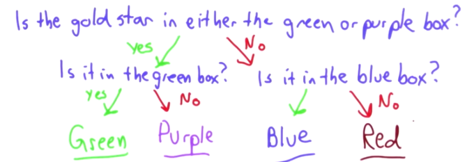

#Intro to Computer Science

**Udacity: CS 101**

---

###Networks

What actually happens when we get the contents of a web page? Let's start by going over *networks*. The idea of a network isn't unique to computing; a network is just another name for **a group of entities that can communicate with one another, even if they aren't directly connected**. You and your family, friends, and colleagues make up your social network, for example.

Let's say I'm friends with you, but don't know your father. I can still communicate with your father though, because I can go through you! With computer networks, each entity is called a *node*.

So, what does it take to make a computer network function properly? We need a few things:

1. A way to encode and interpret messages (think smoke signals in Ancient Greece)
2. A way to route messages
3. Rules for deciding who gets to use the network

###Latency and Bandwidth

**Latency**: The time that it takes for a message to get from the source to the destination

How can we reduce latency? There are a few ways:

* Make the signaling nodes further apart, so there are fewer hops between different nodes
* Find ways to send a message quickly

**Bandwidth**: The amount of information that can be transmitted per unit of time; the rate at which we can transmit information

* Generally measured in Megabits or Gigabits per second. What is a bit?
	* Think of a bit as the answer to one "yes or no" question (0 or 1 with computers, a.k.a on or off). Let's look at this as a question:
		* We have four boxes, and one gold star. Which box is it in? We could ask four questions to find out, but this is quite inefficient, especially when considering the amount of information on the internet. We can actually answer the question in *two* questions, by trying to ask questions that give us an equal yes/no probability:
		

For more on the theory of information, read [this](http://en.wikipedia.org/wiki/Information_theory) article. Note that every time we add a bit, the amount of information we can transmit *doubles* (2^0, 2^1, 2^2, etc...)

###Traceroute

To see how many steps it take (hops) to send packets from your location to a destination, you can run the `traceroute` command (`tracert` on Windows). Here's my location to Udacity's:

	@tylucaskelley ➜  ~  traceroute www.udacity.com
	traceroute to ghs-svc-https-c1001.ghs-ssl.googlehosted.com (72.14.248.239), 64 hops max, 52 byte packets
	1  router.asus.com (192.168.1.1)  0.994 ms  1.162 ms  1.118 ms
	2  216.211.243.1 (216.211.243.1)  11.525 ms  7.679 ms  8.136 ms
	3  192.168.201.1 (192.168.201.1)  7.526 ms  9.114 ms *
	4  gi3-43.mag02.bos01.atlas.cogentco.com (38.104.253.173)  174.146 ms  190.823 ms  203.155 ms
	5  te0-3-0-7.ccr21.bos01.atlas.cogentco.com (154.54.43.69)  18.639 ms
	   te0-3-1-3.ccr22.bos01.atlas.cogentco.com (154.54.7.41)  12.719 ms  12.914 ms
	6  be2095.mpd21.jfk02.atlas.cogentco.com (154.54.30.37)  18.554 ms
	   be2097.mpd22.jfk02.atlas.cogentco.com (154.54.30.117)  19.213 ms
	   be2096.ccr22.jfk02.atlas.cogentco.com (154.54.30.41)  20.866 ms
	7  be2151.mpd22.dca01.atlas.cogentco.com (154.54.40.73)  28.563 ms  26.272 ms
    be2149.ccr22.dca01.atlas.cogentco.com (154.54.31.125)  26.105 ms
    8  be2113.ccr41.iad02.atlas.cogentco.com (154.54.6.169)  27.383 ms
    	   be2176.ccr41.iad02.atlas.cogentco.com (154.54.41.53)  25.748 ms
    	   be2113.ccr41.iad02.atlas.cogentco.com (154.54.6.169)  28.494 ms
	9  38.88.214.50 (38.88.214.50)  22.593 ms  22.605 ms  23.318 ms
	10  209.85.252.80 (209.85.252.80)  25.540 ms
        209.85.252.46 (209.85.252.46)  26.856 ms  25.330 ms
	11  72.14.236.98 (72.14.236.98)  26.362 ms
    	    72.14.236.152 (72.14.236.152)  24.029 ms
    	    72.14.236.148 (72.14.236.148)  22.799 ms
	12  64.233.174.11 (64.233.174.11)  29.688 ms
    	    64.233.174.9 (64.233.174.9)  31.866 ms
    	    64.233.174.11 (64.233.174.11)  36.398 ms
	13  72.14.239.64 (72.14.239.64)  53.902 ms
    	    72.14.239.66 (72.14.239.66)  49.811 ms
        216.239.48.40 (216.239.48.40)  82.464 ms
	14  209.85.248.57 (209.85.248.57)  52.280 ms
    	    64.233.175.12 (64.233.175.12)  49.287 ms
    	    64.233.175.15 (64.233.175.15)  50.894 ms
	15  * * *
	16  ghs-vip-any-c1001.ghs-ssl.googlehosted.com (72.14.248.239)  53.036 ms  55.968 ms  	    61.919 ms
	
We can see that it took 16 steps and a few seconds for me to get data to Udacity.

Back to making a network. We already know these requirements:

1. A way to encode and interpret messages (message --> bits --> electrons/photons)
2. A way to route messages (routers take care of this)
3. Rules for deciding who gets to use the network ("best effort": nobody has priority over anyone else, and sometimes, packets of data can be dropped and lost)

###Protocols

We need a set of rules that explain how two entities can talk to each other. With the web, those two entities are the *client* (your web browser) and the *server* (like udacity.com).

The protocol of the web is called HTTP, or HyperText Transfer Protocol. It's very simple; there are two main messages that can be sent by the client (called requests):

1. `GET`: The server will find the requested file and send it back to the client in a *response*.
2. `POST`: The client requests to make changes to something on the server.