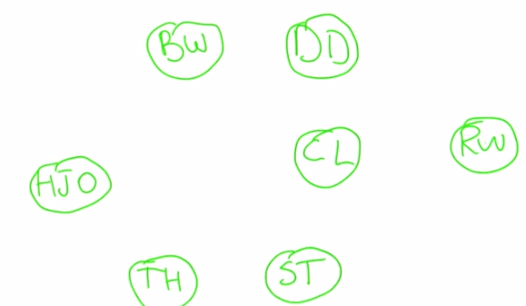
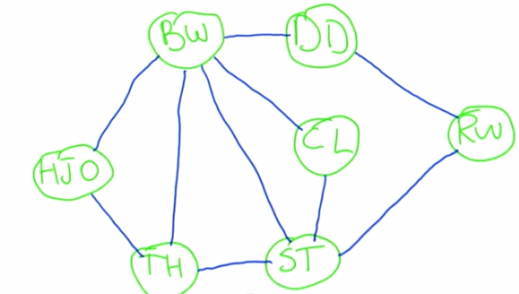
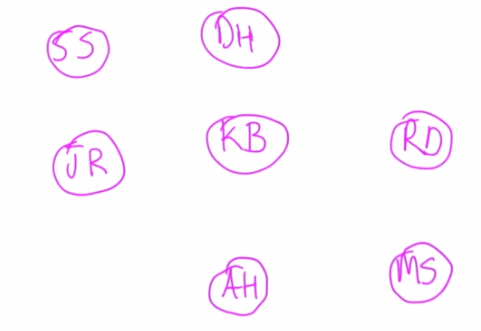
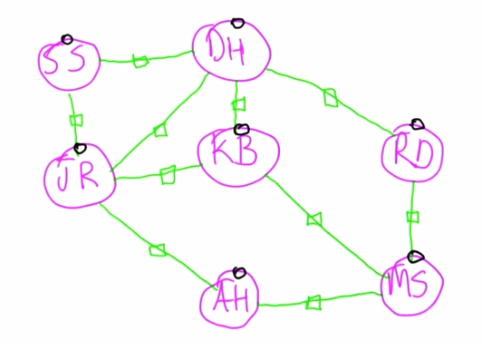

# Intro to Algorithms

**Udacity: CS 215**

---

### Intro to the course

* Instructor: [Michael Littman](http://en.wikipedia.org/wiki/Michael_L._Littman), Professor of Computer Science at Brown University
* Topics covered:
    * Algorithm analysis & runtime
    * Graphs & graph algorithms
    * Heaps & partitioning
    * Trees
    * Shortest path algorithms
    * P vs. NP
* Notable assignments:
    * Analyze a social network

### Lesson 1: Algorithm Analysis

Welcome to the course! The goal of this class is to get an introduction to the analysis and design of algorithms. As long as you have an understanding of high school algebra and Python, you'll do fine!

Let's start off with a little magic trick. Here's a collection of actors from movies:

Let's connect actors who were in movies together using some lines. The structure now looks like this:

Next, we will try to do visit each actor, starting from BW (Bruce Willis), only going over a given line **once**. There are several ways to do this; one way would be:

    BW --> TH --> ST --> BW --> CL --> ST --> RW --> DD --> BW --> HJO --> TH

Try using your finger to follow that path on the image above, and you'll see that each line is only touched once. Let's try this again with a different set of actors:

Just add in all of the connections again:

See if you can do the same thing we did before:

* Visit each actor, only crossing a given path once; that means no backtracking!
* You can (and will have to) visit an actor more than once though.

In case you get stuck, the path I came up with (and there are many options) was:

    MS --> RD --> DH --> KB --> JR --> DH --> SS --> JR --> AH --> MS --> KB

No matter what, you'll end up at Kevin Bacon! Funny how that works, right?

### What was the point of that?

This example illustrates two things that are central to this course:

1. What a social network is: A way of capturing connections between individuals.
2. Algorithms: A way of organizing computations to solve a problem quickly and accurately.

**Graphs**

Let's try to remove some of the magic from that magic trick we just did. The structure we used to represent actors and their connections is called a *graph* in computer science. A graph contains two parts:

1. **Nodes**: These are the points on the graph (actors in our case). Another example would be a computer network, where the nodes would be servers.
2. **Edges**: The connections between nodes.

Nodes also have a property called "degree" (sometimes called valency), which is the number of edges that point to it. For example, in our second graph of actors, the node "KB" (Kevin Bacon) would have a degree of 3.
