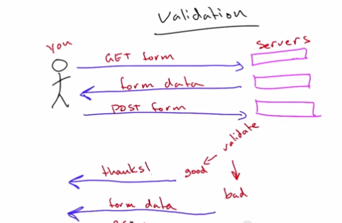

# Web Development

**Udacity: CS 253**

### Lesson 2: Validation

* Validating forms
	* Users will not always enter good data.
		* We can use dropdowns to limit what a normal user will enter, but that won't stop malicious users from simply editing the URL query section.
		* We need to verify all inputs on the server side:
			1. Verify user input
			2. Detect if it's an error
			3. Send output to user (form + error or success) 
		* Form validation process in an image:
			
			
			
* String Substitution
	* "\<b>some bold text\</b>" is inconvenient
	* We can do this instead:
		*  "\<b>%s\</b>" % variable (Python)
	* Can also use dictionaries:
		* "hello my name is %(NAME)s!" % {'NAME': "Ty"}

* Dealing with HTML Problems
	* Quotes in the user input:
		* Would normally screw up the HTML, but can be recitfied using escaping:
			* & -> \&amp;
			
* Redirection
	* Better to GET a response page after making a POST request
		* This way, reloading the page doesn't resubmit the form
		* We can have distinct pages for forms and success pages 