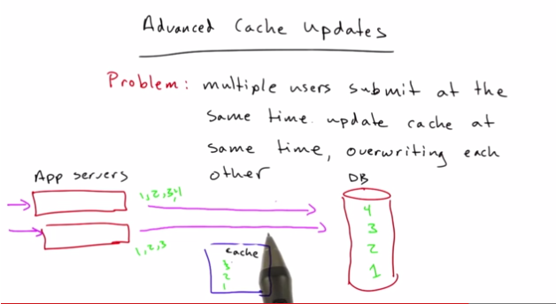

# Web Development

**Udacity: CS 253**

## Lesson 6- Memcached

What is memcached? Caching software. 

* Released in 2003 by a company called Danja.
* Used by Google, YouTube, Facebook, Reddit, etc
* Most common piece of software other than Linux

Works by storing keys to values. Operations are:

1. `set(key, value)` : assigns a key to a value and stores it
2. `get(key)` : returns key's value or None
3. `delete(key)` : deletes a key from the cache
4. `flush(key)` : clears the cache

A simple Python program to emulate memcached's behavior would look like this:

	CACHE = {}

	def set(key, value):
    	CACHE[key] = value
    	
	def get(key):
		return CACHE.get(key)
		
	def delete(key):
    	CACHE.pop(key, False)
    	
	def flush():
    	CACHE.clear()

#####Properties of Memcached

1. Stores everything in memory, so it is very fast but **NOT** for storing permanent data.
2. Limited by the amount of RAM on a machine; storing too much data causes the oldest data to be overwritten. (LRU, or "least recently used" cache)

#####Stateless

With memcached, app stores no state between requests, which means apps are now interchangeable. Apps can be scaled independently of cache and database. Adding more apps is simple and easy.

#####Advanced Cache Updates

What if multiple people write to the database at the same time?

Solution: **CAS**.

#####CAS (Check and Set)

`get(key)` returns a value, as well as a "unique"
 
 This unique value allows memcached to prioritize and execute only one write at a time on the database. Below is an example of how CAS would work in Python:

	def cas(key, val, unique):
		r = gets(key)
		if r:
			v, u = r
			if u = unique:
				return set(key, val)
			else:
				return False

#####Summary

Why do we separate our services?

1. They can be scaled independently
2. Increase fault tolerance
3. No competition over resources
4. They can be updated independently