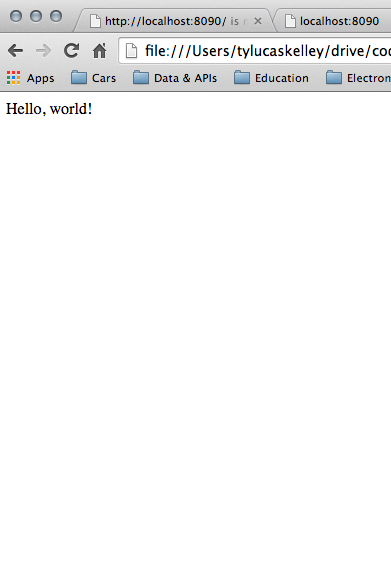

# Web Development

**Udacity: CS 253**

---

### HTML: HyperText Markup Language

HTML documents are the heart of the web; they can do a number of things. HTML is made up of:

* Text content that you see
* Markup (what it looks like)
* References to images, videos, and other files
* Links to other HTML pages

You can experiment with HTML by going to [this website](http://jsfiddle.net/WW3bh/)!

**Plain Text**

Plain text in an HTML document is just plain text; there's nothing changed.

You can prove this by creating a new document, called `hello.html`, and filling it in like this:

    Hello, world!

If you were to open that HTML page in your browser, you'll notice that the page looks something like this:

