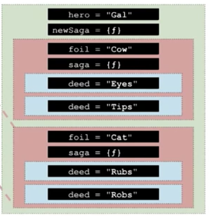

# Object-Oriented JavaScript

**Udacity: UD 015**

---

### Execution Contexts

Now that we know about scope in JavaScript, it's time to talk about something new. This something is the concept of *execution contexts*, a.k.a in-memory scopes.

Execution contexts are defined at run-time. This is different from lexical scopes, which are defined as the code is written. Its rules govern which variables a program has access to at different points in the code's execution.

Take a look at this example:

    var hero = aHero();
    
    var newSaga = function() {
        var foil = aFoil();
        
        var saga = function() {
            var deed = aDeed();
            console.log(hero + deed + foil);
        };
        
        saga();
        saga();
    };
    
    newSaga();
    newSaga();

When the program is run, it will be keeping track of which variables are available to different funcion objects. Since each new function call operates independently of previous calls, multiple execution contexts can be created in one run of a program. Note that the execution context is not something you can access in your program; it's simply the interpreter's way of organizing what's going on at runtime.

Step 1 is to create the data storage system for the global scope:

1. After line 1, the `aHero` function is called, and let's pretend it returned the value "Gal". That means the key-value pair of `hero = "Gal"` is added to the global execution context.
2. When `newSaga` is defined, the value assigned to it by the interpreter is simple a generic function object. Everything inside is ignored until the function is actually called. At this point, our execution context would look like this:

        //globals
        hero = "Gal"
        newSaga = function
        
3. Next, `newSaga` is called. This will create a new execution context, so there is room for variables that are local to that call of the function. To that new scope, the pairs of `foil = "Cow"` and `saga = function`.
4. Once `saga` is called, another context is created! This process continues...

When all is said and done, we could illustrate the execution context like this:

Running our code at this point would give the output of:

    GalEyesCow
    GalTipsCow
    
    GalRubsCat
    GalRobsCat

The green box is the global execution context, and the red boxes are contexts local to each call of `newSaga`. The blue boxes inside of the red ones are local to each call of `saga`. Notice that each value for `saga` or `newSaga` is different for each time it is called! If we had the ability to compare the two using `===`, the test would fail.

We could demonstrate this in an example you can run on your computer (assuming you have [Node.js](http://nodejs.org) installed):

    var makeArray = function() {
        return [];
    };
    
    var a = makeArray();
    var b = makeArray();
    
    console.log(a === b); //false!