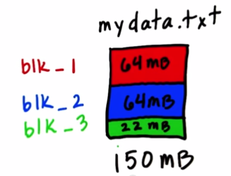

#UD 617: Intro to Hadoop and MapReduce

**Udacity**

---

###Lesson 2: HDFS and MapReduce

**HDFS**

With Hadoop, files are stored in something called the Hadoop Distributed File System, or HDFS. When a file is loaded into HDFS, it is split into chunks, called "blocks". Each block is given a unique name, which is generally in the format of "blk_1" or "blk_1000", etc.

As the file is uploaded to HDFS, each block will get stored in a node on the cluster. There is a [daemon](https://kb.iu.edu/d/aiau) running on each of the machines in the cluster called the "data node". However, knowledge of which blocks make up the original file is handled by a separate daemon (on a different machine) called the "name node". The information stored on the name node is called the "metadata".

There are problems with this approach that need to be considered:

* Disk failure on the name node
* Disk failure on the data node
* Network failure

**Data Redundancy**

If a node goes missing or fails, we are left with missing data for a file. To solve this problem, Hadoop replicates each block of data *3 times*, and places the replicated blocks on different machines. So if one block fails, we have 2 backup blocks for security. And the block that fails will be re-replicated later, bringing us back to 3 copies of every block.

This still leaves another problem: what happens when the name node fails?

* If there is a network failure on the name node, the data may be temporarily inaccessible.
* If the metadata is corrupted or lost, however, the data can be permanently lost. To get around this, an [NFS](http://en.wikipedia.org/wiki/Network_File_System) was used to replicate the name node's data on another filesystem. A better solution exists today: having *two* name nodes.
  * The "active" name node works as before.
  * The "standby" name node can be configured to take over for the active name node if it fails.
  
**Playing around with HDFS**

1. Click [here](http://content.udacity-data.com/courses/ud617/Cloudera-Udacity-Training-VM-4.1.1.c.zip) to download the VM and data sets needed to try out Hadoop HDFS. As a warning, the file size is 4.7 GB when uncompressed.
2. Download and install [Oracle VirtualBox](), and create a new Linux virtual machine.
3. When asked about the hard drive, select the option that allows you to choose an exisitng virtual hard drive file, and select "Cloudera-Udacity-Training-VM-4.1.1.c.vdmk"
4. Start the VM and play around! [Here](http://hadoop.apache.org/docs/r0.19.1/hdfs_shell.html) is a list of available commands for use in the shell.

Every command you will type will look like this:

    $ hadoop fs -ls
    
or

    $ hadoop fs -cat

**MapReduce**

Let's say you have a large file. Processing the file's data serially (line-by-line) could take a very long time. MapReduce works by processing data in parallel, meaning that the file is broken into chunks, and each chunk is processed at the same time. Here is a real-world example:

* Let's imagine we run a retailer, with thousands of stores around the world. We have a ledger containing all of our sale information for the year 2012. The ledger looks something like this: 
  
      2012-01-01 London Clothes 25.99
      2012-01-01 NYC Toys 18.99
      2012-01-02 Miami Music 3.50
      2012-01-02 London Clothes 65.49
      
* One way to process the ledger would be to read through it, and start building a list that looks like this:
  
      London Clothes 25.99
      NYC Toys 18.99
      Miami Music 3.50
      
* When a duplicate store is reached in the ledger, the amount in that store's row would be updated:

      London Clothes 91.48
      NYC Toys 18.99
      Miami Music 3.50
      
* To solve this problem, a [hashtable](http://en.wikipedia.org/wiki/Hash_table) would traditionally be used for storing key-value pairs. However, with a large data set like ours, we could easily run out of memory or simply take too long via this method. Let's see how [MapReduce](https://www.youtube.com/watch?v=LZfCPgQmeRU#t=67) can help here. 
  1. *Mappers* are programs that each deal with a small amount of data, and work in parallel. Their output is a bunch of key-value pairs called the *Intermediate Records*.
  2. The Mappers then begin the *Shuffle* process, which is the phase in which the Intermediate Records are moved from the Mappers to the *Reducers*. Even with multiple Reducers, the keys may not be evenly distributed among them.
  3. The *Sort* process is how the Reducers organize the records into sorted order.
  4. The Reducers then process the values in some way to get the final results.
  5. To get the results in a sorted order, there is an extra step to merge the results.
  
[Here](https://developer.yahoo.com/hadoop/tutorial/module5.html#partitioning) is a nice overview of partitioning in Hadoop.
  
**Daemons of MapReduce**

1. Job Tracker: Splits the work into Mappers and Reducers
2. Task Tracker: Runs on the same machine as the data nodes to save network traffic, and handles the actual running of the Map and Reduce tasks.

**Running a Job with MapReduce**

