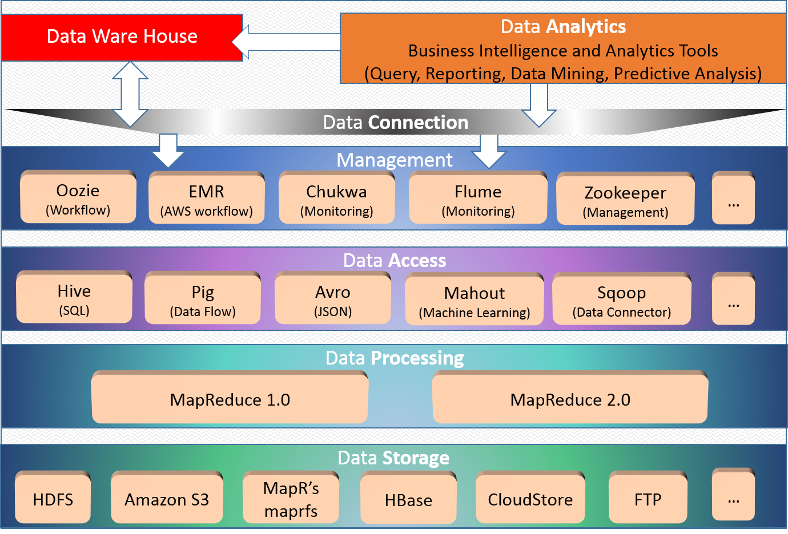

#Intro to Hadoop and MapReduce

**Udacity: UD 617**

---

###Hadoop's Origins

**The Nutch Project**

In 2003, [Doug Cutting](http://en.wikipedia.org/wiki/Doug_Cutting) was working on an open-source search engine called ["Nutch"](http://en.wikipedia.org/wiki/Nutch). Doug knew that Nutch had to be scalable; the web was already many petabytes of data at that point, and continued to grow. This scalability problem led to roadblocks in Nutch's development.

Around that same time, Google had published two papers. One was about [GFS](http://static.googleusercontent.com/media/research.google.com/en/us/archive/gfs-sosp2003.pdf), their distributed file system, and the other was about their processing framework, [MapReduce](http://static.googleusercontent.com/media/research.google.com/en/us/archive/mapreduce-osdi04.pdf).

Doug and another person, [Mike Cafarella](http://web.eecs.umich.edu/~michjc/), set out to re-implement Google's systems in open-source. This would give everyone in the world access to use them, instead of just Google. After a few years, Nutch was running in a much more distributed fashion: ~40 machines instead of 4 or 5. However, this wasn't good enough, and Doug realized that this project was going to need more than two people working part time.

**Hadoop**

It was around that time when Yahoo approached Doug, showing interest in Nutch. Doug and his team at Yahoo took the distributed aspect of Nutch and started developing it as its own project, called Hadoop. After a couple of years, Hadoop was scaling to thousands of machines and petabytes of data.

Hadoop quickly spread to a bunch of internet companies, and was very successful. Many smaller projects grew around Hadoop; it became a "kernel" for an operating system in that sense. There is an entire Hadoop ecosystem, built around scalable data processing.

Hadoop has an elephant logo; how did this happen?

It's actually a very funny story: the name "Hadoop" comes from Doug's son's toy elephant. He played with it all the time, and gave it a made-up name: "Hadoop". Doug wrote it down, just in case he ever needed a name for a software project. (Note: Doug's son is now jokingly claiming that he should get royalties for the name)

###Core Hadoop

The main Hadoop project consists of a way to store and process data. Storage is handled by splitting data up among a collection of machines (the "cluster") and putting it into the Hadoop Distributed File System, a.k.a HDFS. MapReduce then process the data *where it is stored*, which leads to high speed and efficiency when compared to retrieving data from a central server.

What is nice about Hadoop is that the computers in a cluster *don't need to be high end*. Low to mid-range hardware will do just fine becasuse Hadoop is built around the idea that the software should assume that all hardware will fail at some point.

There is much more to Hadoop than just HDFS and MapReduce:

###Hadoop Ecosystem

Much of the other software that has been developed around Hadoop centers around making things easier for people. For example, writing MapReduce code can be a challenge for non-programmers that need to analyze data.

Here are some brief introductions to a few aspects of the Hadoop ecosystem:

* HBase: The Hadoop database; alternative to relational databases
* Hive: Using SQL queries to analyze data sets
* Impala: Parallel processing SQL query engine for accessing data in HDFS / HBase without moving data
* Mahout: A scalable machine learning library
* Pig: Simple data-flow language used for analyzing large data sets