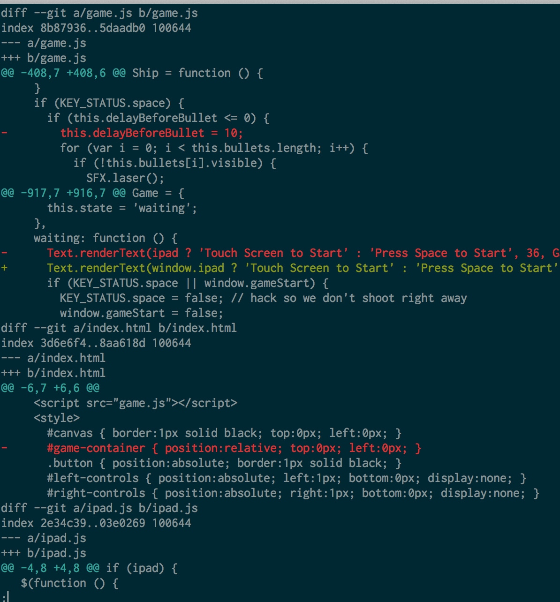

# Version Control

**Udacity: UD 775**

---

### Using Git

Once you have Git installed on your system (just type "git --version" to check), you can start using it right away! Udacity has provided a repository that we can download and start working on, called "Asteroids".

**Cloning a repo**

To get this Asteroids repository (or "repo"), we're going to need a command called `git clone`. Cloning a repo just means making our own copy. Type this into your command line to get "Asteroids":

    $ git clone https://github.com/udacity/asteroids.git
    
Once the repo has finished cloning, go ahead and `cd` into it:

    $ cd asteroids
    
Now you can try out the commands I showed you from before:

1. `git log` (press "q" to quit once in the log)
    * If you want colored output, you'll have to change Git's settings: `git config --global color.ui auto`
2. `git diff`
    * Compare these two hashes: df035382 and 25ede8369 (notice that we don't need the full hash)
    
Your diff should look something like this:
    

Now for a challenge! Try to find the ID of the commit with the message "Revert controls" using only what we know so far. How many lines were added and deleted in that commit?

Here's the commit we're looking for:

    commit b0678b161fcf74467ed3a63110557e3d6229cfa6
    Author: cbuckey <caroline@udacity.com>
    Date:   Mon May 24 04:15:21 2010 -0700

        Revert controls

    game.js | 8 ++++----
    1 file changed, 4 insertions(+), 4 deletions(-)

Here's a trick for those of you who are handy with the UNIX command line:

    $ git log --stat | grep -B 5 -A 5 "Revert controls"
    
That'll give you everything you need to see without having to scroll around at all!

### Checking out old versions of code

What if we wanted to restore an old version of code? Git takes care of that, thanks to a handy command called `checkout`. "Checking out" a commit means reverting to whatever things looked like at the time the commit was made.

Checking out can be useful if we wanted to find which commit introduced a bug that's been bothering us, for example.

Let's see checking out in action with our "Asteroids" game. First, open up the `index.html` file in Chrome or Firefox to see what the most recent version of the game looks like:

And then type this at the command line to temporarily switch to a different commit (without losing any new stuff):

    $ git checkout 7dc3de00f48a2e6
    
The game should now look like this if you open the file again:

We can easily go back to the most recent commit like this:

    $ git checkout master
    
We'll get to what "master" means shortly.