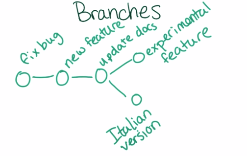
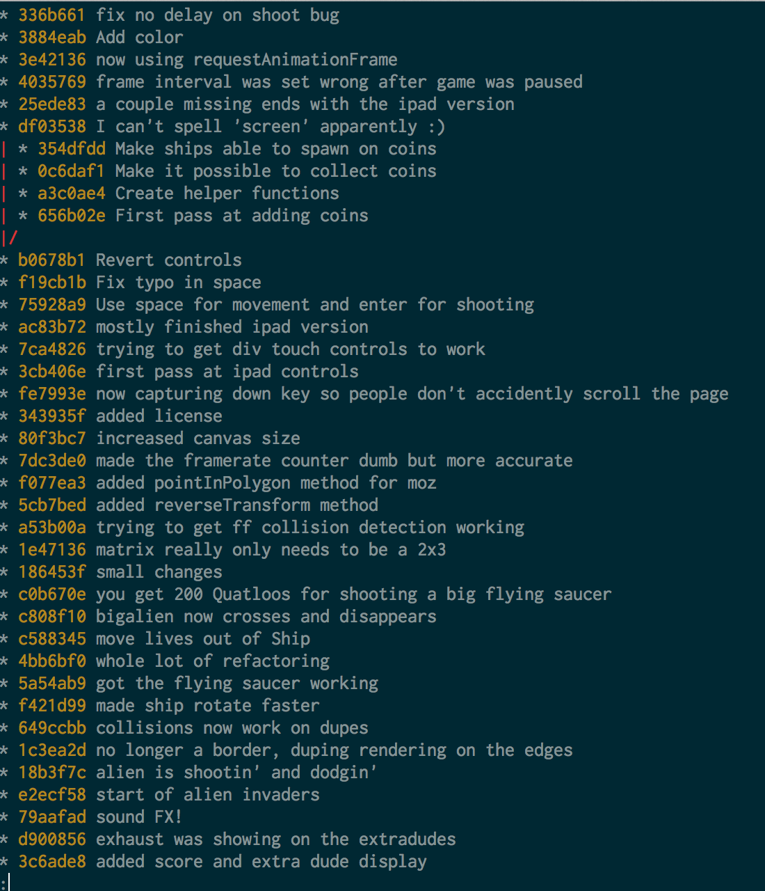

# Version Control

**Udacity: UD 775**

---

### Branching

So far, we can create repositories and commit changes we make to them. This has been a pretty linear path: make change, commit, make change, commit, etc. What if we wanted to branch off at a commit and work on two versions side-by-side? This is called branching.

Git lets us do this, with the intuitively named `branch` command. We can have as many branches as we want based on a commit. This is great for having a stable version of your code, and then testing out experimental features on branches.

To make staying organized easier, all branches can have names. The default branch that we've been working on so far is called the "master" branch.

Another thing we will touch upon later is putting two branches together, in a process called "merging".

### Creating an "easy mode" for our game

To try out branching ourselves, let's create an "easy mode" for the Asteroids game. We will use branches so that the original version is preserved too.

Go to the command line to get started:

    $ cd asteroids
    
To see what branches we already have, run `git branch` with no arguments:

    $ git branch
    * master

`master` is the only branch right now, which makes sense. Let's create our own:

    $ git branch easy-mode
    $ git branch
    easy-mode
    * master
    
The "*" tells us which branch we are currently on. Let's switch to the easy-mode:

    $ git checkout easy-mode
    Switched to branch 'easy-mode'

We're here! Right now, the easy-mode branch is exactly the same as master, since that's where we checked out from. Let's make the game easy by changing the delay before a bullet is shot. Go to line 424 in `game.js` and change `this.delayBeforeBullet = 10;` to `this.delayBeforeBullet = 5;`. Run the game by opening `index.html` to see how much easier it is!

We can commit those changes and then check out where we're at:

    $ git status
    On branch easy-mode
    nothing to commit, working directory clean
    
Branching is as easy as that! Now we have two branches: a master branch for the original version of the game, and an easy-mode branch for an easier version.

### Collaboration

Branching can be great for when you're working with other people on a project. The "master" branch should be the stable, "production-ready" version with no bugs. Any time a new feature is introduced, it should be worked on in its own branch until it is stable enough to be merged back with master. We will cover merging soon!

There's another branch in our Asteroids game that Caroline has gone and created for us. It adds a new "coins" feature to the game. Let's check it out:

    $ git checkout coins
    Branch coins set up to track remote branch coins from origin.
    Switched to a new branch 'coins'
    
Whoa, what's all this new terminology? Basically, this means that we're checking out a branch that someone else created on the repository. Now, we have a local copy of the "coins" branch to work on.

**Git log --graph**

We can use `git log` to help us see differences between different branches, all displayed together in a readable format. Right now you should be on the "coins" branch. Run this:

    $ git log --graph --oneline master coins
    
And you should see something like this:

The interesting piece is here:

    * df03538 I can't spell 'screen' apparently :)
    | * 354dfdd Make ships able to spawn on coins
    | * 0c6daf1 Make it possible to collect coins
    | * a3c0ae4 Create helper functions
    | * 656b02e First pass at adding coins
    |/
    * b0678b1 Revert controls
    
We can see where the coins branch was created, and how there have been some commits on both branches since the split.

### Reachability and 'detached HEAD' state

Recall when we were on the master branch a while back, and reverted to and older commit using `git checkout [hash]`. We then got this scary message:

    Note: checking out 'a3c0ae46a65126fc8'.

    You are in 'detached HEAD' state. You can look around, make experimental
    changes and commit them, and you can discard any commits you make in this
    state without impacting any branches by performing another checkout.

    If you want to create a new branch to retain commits you create, you may
    do so (now or later) by using -b with the checkout command again. Example:

    git checkout -b new_branch_name

To understand this message, we need to talk about a concept called "reachability". Every git commit has a parent, and the commit knows about its parent. That means if we revert to an older commit, and then start making changes and commit them, that new commit is unreachable. That's why we get a warning message when we checkout an old commit! Git is warning us that our changes will be lost unless we create a new branch from that old commit instead. Let's illustrate this (with one branch for simplicity):

    * latest commit (*) <-- we are here
    * second commit
    * first commit
    
Pretty simple so far! Let's checkout that first commit:

    * latest commit
    * second commit
    * first commit (*) <-- we are now in the detached HEAD state
    
Everything is okay depite the warning, as long as we do one of two things:

1. Do nothing and go back to the latest commit once we're done poking around
2. Create a new branch from that old commit

But, what happens if we make some changes and commit? Unfortunately, once we leave that commit, it is no longer reachable.