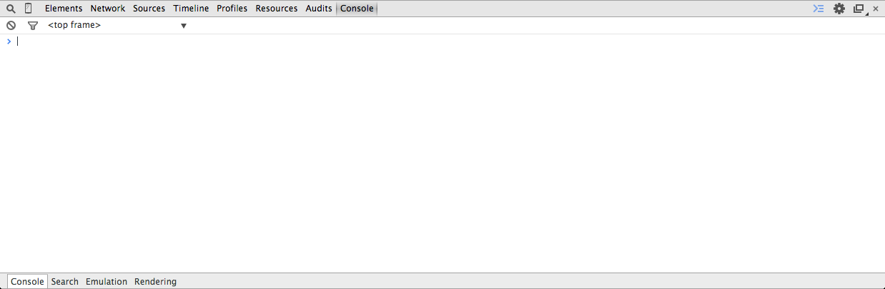

# JavaScript Basics

**Udacity: UD 804**

---

### Hello, JavaScript!

Time to write our first bit of JS code. Go to your browser (I like Chrome), and open up the [Developer Tools](https://developer.chrome.com/devtools). If you can't figure out how to open them, do a quick Google search for your browser.

The developer tools console should look something like this:

The first bit of code we will be writing will be the obligatory "Hello, World!" program. Simply type this and hit Enter:

    console.log('Hello, JavaScript!');
    
You should see the string 'Hello, JavaScript!' echoed back to you, followed by "undefined". There are a couple things to note here:

1. `console.log()` is the JS equivalent of Python's `print` or C's `printf`.
2. "undefined" is the return value of the function `console.log`.
3. Semicolons! You don't [need](http://www.codecademy.com/blog/78-your-guide-to-semicolons-in-javascript) them in most JS interpreters, but it's good practice to use them.

### Time to have fun

Go to [https://www.udacity.com](https://www.udacity.com), and open up the developer console. Then, paste this and hit enter:

    $(".super-header-wrapper").html("");
    
Watch in awe as the Udacity homepage breaks! That was fun, but there's a lot of new stuff in that one line that needs some explaining.

1. We're using jQuery
    * Notice the funny `$('content')` syntax? That dollar sign is how you know you're using jQuery. (Yes, you can use it without jQuery as a variable name, but it's synonymous with jQuery at this point). What we're saying when we do this is find the HTML element with the class 'super-header-wrapper' and return the jQuery object; this adds a lot of functions we can use to manipulate the DOM.
2. HTML strings
    * The reason JS was invented was for DOM manipulation; this is readily apparent here, as we are changing the `style` and `src` attributes for the `super-header-wrapper` image.

In case you're wondering why we're using jQuery instead of regular JavaScript, look no further than this:

* With jQuery: `$(".super-header-wrapper").html("");`
* Plain JS: `document.getElementsByClassName('super-header-wrapper')[0].innerHTML = "";`

So, hopefully you can see that jQuery provides the benefit of abstracting away the ugly DOM manipulation that we'd normally have to write.